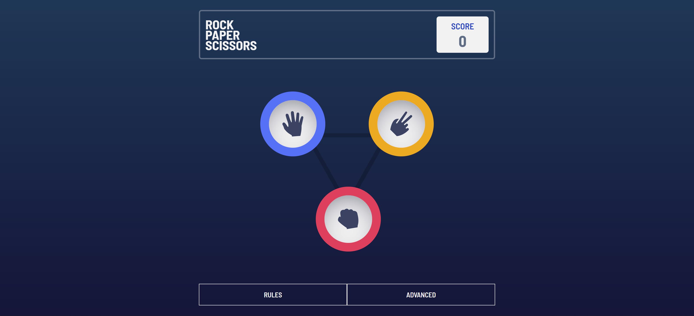
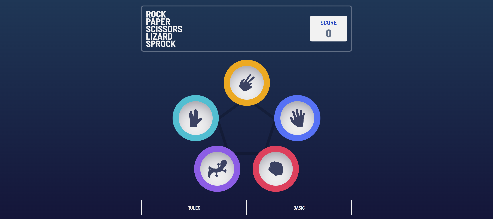
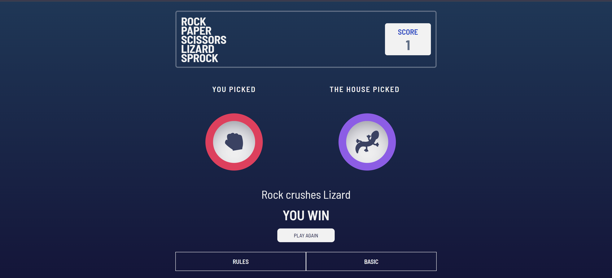
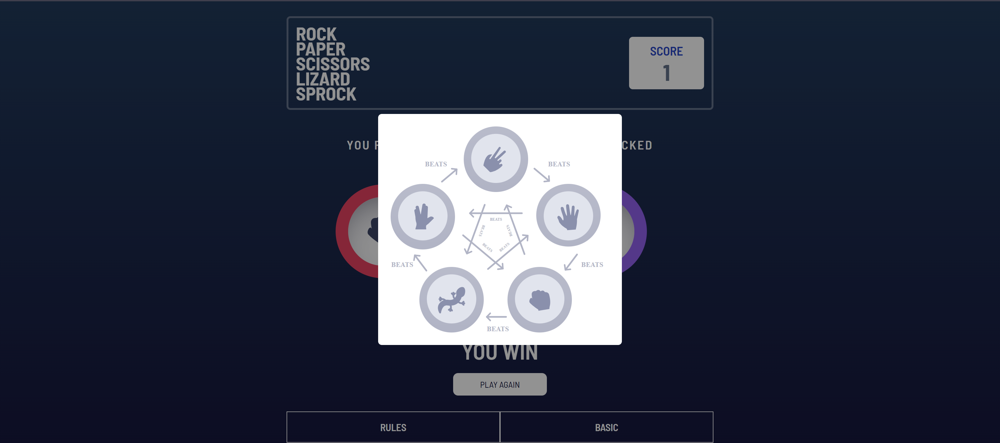

# rock_paper_scissors 
A simple Rock-Paper-Scissors game built with react, typescript and tailwind. Features player vs. computer mode, random AI selection, and a clean UI. Play, win, or lose—may the best choice win!

## Installation 
1. Clone the repository: 
```bash
 git clone https://github.com/Linushaddai99/rock_paper_scissors.git
```

2. Install dependencies
```bash
npm install 
```

## Usage
To run the project, use the following command:
```bash
npm run dev
```

## Screenshots








## [Live site](https://spancheck.netlify.app/)

## License
This project is licensed under the [MIT License](LICENSE).